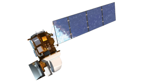

class: middle
```{r, eval=FALSE ,include=FALSE}
<div class="pull-left">
  <h1 class="normal-font"> 
    Table of content
  </h1>

  <h2 class="normal-font"> 
    1. Introduce to LandSat
  </h2>

  <h2 class="normal-font"> 
    2. Working Principle
  </h2>
  
  <h2 class="normal-font"> 
    3. Data Collection
  </h2>

</div>
```

.pull-left[
# Table of content

## 1. Introduce to LandSat

## 2. Working Principle

## 3. Data Collection

## 4. Summary
]

<div class="pull-right"> 

```{r setup, include=FALSE}
options(htmltools.dir.version = FALSE)
```

```{r, echo=FALSE}

```
</div>
---

class: inverse, center, middle

## Introduce to LandSat (Part 1)

Landsat 8 is an Earth observation satellite operated jointly by the 
<span class="bigger-font">U.S. Geological Survey (USGS)</span> 
and the 
<span class="bigger-font">National Aeronautics and Space Administration (NASA).</span>


.bigger-font[*Lunch Date:]

February 11, 2013

.bigger-font[*Payload:]

Landsat 8 carries an advanced optical payload called the Operational Land Imager (OLI) and a Thermal Infrared Sensor (TIRS). These payloads provide high-quality multispectral and thermal infrared data.

.bigger-font[*Spectral Range:]

The OLI payload on Landsat 8 covers multiple bands from ultraviolet to near-infrared, short-wave infrared, and mid-infrared. There are a total of 11 bands. The TIRS payload provides two additional thermal infrared bands.

---

class: inverse, center, middle

## Introduce to LandSat (Part 2)

Landsat 8 is an Earth observation satellite operated jointly by the 
<span class="bigger-font">U.S. Geological Survey (USGS)</span> 
and the 
<span class="bigger-font">National Aeronautics and Space Administration (NASA).</span>

.bigger-font[*Spatial Resolution:]

The spatial resolution of OLI is 30 meters, while the TIRS resolution is 100 meters (thermal infrared bands) and 30 meters (other bands).

.bigger-font[*Data Availability:]

Landsat 8 data is provided by the USGS and can be accessed through the Earth Resources Observation and Science (EROS) Center data archive.

---

class: inverse, center, middle

## Working Principle

.bigger-font[*Operational Land Imager (OLI):]

- Capture images in multiple spectral bands, including visible, near-infrared, and short-wave infrared.
- Band <---> Wavelengths

.bigger-font[*Thermal Infrared Sensor (TIRS):]

- Measure thermal infrared radiation emitted by the Earth's surface. (E.g., Temperature variations)
- TIRS has two thermal bands that capture heat emitted by the Earth, enabling the monitoring of surface temperature changes.

---

class: inverse, center, middle

## Data Collection

- Landsat 8 follows a sun-synchronous orbit, which means it passes over the same part of the Earth at the same local solar time on each orbit.
- The satellite covers the entire Earth's surface every 16 days, capturing images of the same location under different lighting and seasonal conditions.

.bigger-font[*Applications:]

- Land cover classification
- Environmental monitoring
- Agriculture
- Forestry
- Disaster management

---

class: center, middle

## Summary

Overall, Landsat 8 plays a crucial role in Earth observation, providing valuable data for monitoring and understanding the dynamic processes occurring on the Earth's surface. The combination of visible, infrared, and thermal bands allows for comprehensive analysis and applications in various fields.


